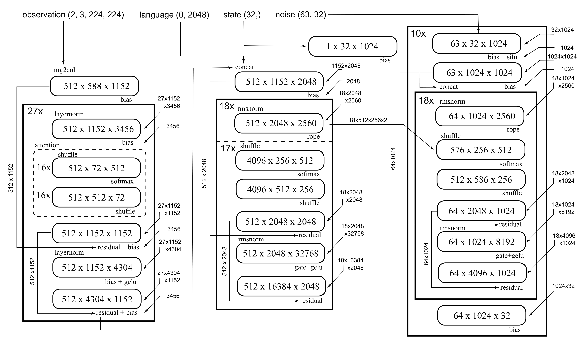

# Running VLAs at Real-time Speed

This project provides accelerated inference kernels of the Pi0 model from [OpenPI](https://github.com/Physical-Intelligence/openpi) project.


*Real-world demonstration: catching a falling pen with sub-200ms end-to-end latency using 30 FPS inference. (From "[Running VLAs at Real-time Speed](https://arxiv.org/abs/2510.26742)")*


The inference time for one set of observations (10 flow steps, 63 chunk size, empty prompt) on RTX 4090 (max boosted clock 2.79GHz) is as follows:

| 1 view | 2 views | 3 views |
|---|---|---|
| 20.0ms | 27.3ms | 36.8ms |

For more realistic settings (prompt length 20 tokens, 50 chunk size), we have
| 1 view | 2 views | 3 views |
|---|---|---|
| 23.6ms | 32.9ms | 39.2ms |

To match camera speeds, you should consider using **30fps** for one or two views , and **25 fps** for three views.


## How to Use

The intended usage is to directly copy the pi0_infer.py file into your project. The usage is:
```python
converted_checkpoint = pickle.load(open('converted_checkpoint.pkl', 'rb'))

from pi0_infer import Pi0Inference

infer = Pi0Inference(converted_checkpoint, number_of_images, length_of_trajectory)
output_actions = infer.forward(
   normalized_observation_image_bfloat16, # (number_of_images, 224, 224, 3)
   observation_state_bfloat16, # (32,)
   diffusion_input_noise_bfloat16, # (length_of_trajectory, 32)
)
```

```bash
python3 convert_from_jax.py \
   --jax_path /path/to/checkpoint/folder\
   --output converted_checkpoint.pkl\
   --prompt "your task prompt"
   --tokenizer_path /path/to/paligemma-3b-pt-224
```

The code is specifically tuned on RTX 4090, CUDA 12.6, but it should work on similar platforms so long as torch and triton themselves work.

## Checking Performance

You can check the inference time on you local machine by
```bash
python3 benchmark.py --num_views 2 --prompt_len 0 --chunk_size 63
```

## Structure of the Code

The implementation is organized into three main components: a vision encoder, an LLM, and an action expert. Each component is decomposed into fundamental operations, with the entire computation graph simplified to 24 GEMM-like operations and associated scalar operators. This modular structure allows for efficient Triton kernel optimization at each computational stage.


*Simplified computation graph showing the 24 GEMM-like operations that constitute the core of the inference pipeline.*


## Acknowledgements

This project is developed based on Physical Intelligence's [OpenPI](https://github.com/Physical-Intelligence/openpi) project.


## Citation

If you want, you can cite this work with:

```bibtex
@article{ma2025rtvla,
  title={Running VLAs at Real-time Speed},
  author={Ma, Yunchao and Zhou, Yizhuang and Yang, Yunhuan and Wang, Tiancai and Fan, Haoqiang},
  journal={arXiv preprint arXiv:2510.26742},
  year={2025}
}
```
